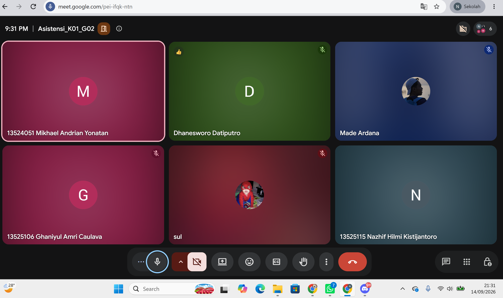

# Form Asistensi

## Tugas Besar IF2150 - Rekayasa Perangkat Lunak

| Informasi | Keterangan |
| --- | --- |
| **Hari** | Senin |
| **Tanggal** | 14/09/2026 |
| **Kelas** | K01 |
| **Nomor Kelompok** | G02  |
| **Nama Kelompok** | Indeks A  |
| **Nama Perangkat Lunak** | ITBELI  |
| **Dokumen** | K01_G02_RG & K01_G02_UC  |

### Anggota Kelompok

| NIM | Nama |
| --- | --- |
| *13525124* | *Sulthan Dhiyazka Suwandi* |
| *13525034* | *Dhanesworo Muhammad Datiputro* |
| *13525115* | *Nazhif Hilmi Kistijantoro* |
| *13525121* | *I Made Adi Kusuma Ardana* |
| *13525106* | *Ghaniyul Amri Caulava* |

### Catatan

| Catatan |
| --- |
| 1. Review aktivitas: yaitu Kebutuhan user/apa yang dilakukan user.  |
| 2. Review KF: Sistem harus punya apa untuk memenuhi aktivitas user. |
| 3. Use case: apa yang bisa dilakuin User dengan sistem kita.|
| 4. Use case udah bener, yaitu boleh gabung2in dari beberapa KF. |
| 5. Buat diagram, garisnya dirapih2in kalo bisa jangan sampai ada yang tabrakan. |
| 6. Ganti buat UC15  gausah ada  kata listingnya, jadi tulisannya “Melihat Detail Katalog” aja. |
| 7. Buat bagian Bab 2, kolom kebutuhan itu tulis ID kebutuhannya cukup. |
| 8. Kalo di trace dari milestone-milestone sebelumnya, Use case itu ada yang ga cocok berdasarkan aktivitas di milestone sebelumnya. |

**Notes for this section:**  
*Catatan dapat dituliskan dalam bentuk paragraf atau poin-poin, disesuaikan saja.* 

## Dokumentasi

<!--  -->

  

  <i>Gambar 1. Dokumentasi kegiatan asistensi.</i>

