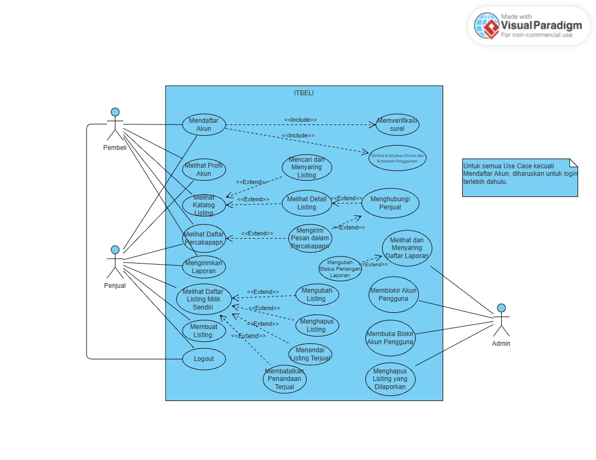

<h1>
IF2150 REKAYASA PERANGKAT LUNAK
 
TUGAS 3
 
USE CASE & SCENARIO USE CASE
</h1>
 

## *Nama Perangkat Lunak*

### Untuk: *Mikhael Andrian Yonatan*

Dipersiapkan oleh:
| Informasi | Keterangan |
| --- | --- |
| Kelas | *K1* |
| Kelompok | *2*  |

| NIM | Nama |
|---|---|
| *13525124* | *Sulthan Dhiyazka Suwandi* |
| *13525034* | *Dhanesworo Muhammad Datiputro* |
| *13525115* | *Nazhif Hilmi Kistijantoro* |
| *13525121* | *I Made Adi Kusuma Ardana* |
| *13525106* | *Ghaniyul Amri Caulava* |
---

## Daftar Perubahan

| Revisi | Deskripsi |
| :--- | :--- |
| *A* | *Deskripsikan perubahan yang dilakukan dari dokumen sebelumnya pada dokumen ini. Jika tidak terdapat perubahan, harap kosongkan tabel.* |
| *B* |  |
| *C* |  |
| ... |  |

 
 

# BAB 1: Deskripsi Perangkat Lunak
**ITBELI** adalah sistem marketplace barang preloved yang dikhususkan bagi civitas ITB, mempertemukan mahasiswa yang ingin melepas barang bekas layak pakai dengan mahasiswa lain yang membutuhkannya dalam satu ekosistem yang terpusat, dapat ditelusuri, dan lebih terpercaya dibandingkan media lainnya maupun marketplace umum yang selama ini digunakan.

Sistem ini melibatkan tiga pihak pengguna yang saling berinteraksi melalui perangkat lunak, yaitu Penjual, Pembeli, dan Admin, ditopang oleh proses bisnis nyata berupa kesepakatan harga dan serah terima barang secara Cash on Delivery (COD) di titik temu kampus yang berada di luar cakupan perangkat lunak itu sendiri.

Dari sisi Penjual, ekspektasi utama terhadap sistem adalah kemudahan dan kecepatan proses listing. Penjual mendaftar dan melakukan login menggunakan surel berdomain @itb.ac.id, kemudian membuat listing barang dengan mengunggah foto, mengisi deskripsi kondisi, menentukan harga, dan memilih kategori yang sesuai dengan kebutuhan kampus. Begitu listing dipublikasikan, sistem menjangkaunya kepada seluruh mahasiswa ITB yang terverifikasi tanpa bergantung pada jangkauan grup atau circle pertemanan penjual. Setelah barang laku, penjual menandai listing sebagai terjual agar tidak lagi muncul di hasil pencarian dan tidak menimbulkan kesalahpahaman bagi calon pembeli lain.

Dari sisi Pembeli, sistem diharapkan menjadi satu titik pencarian tunggal yang efisien. Pembeli mencari barang berdasarkan nama, kategori, atau rentang harga, membuka detail listing untuk melihat foto dan kondisi barang, lalu menghubungi penjual melalui fitur percakapan internal untuk bernegosiasi harga serta menyepakati waktu dan titik temu COD. Seluruh proses ini berlangsung tanpa perlu berpindah ke aplikasi lain, dan pembeli mengharapkan jaminan bahwa pihak yang diajak bertransaksi benar-benar merupakan mahasiswa ITB yang identitasnya dapat dipertanggungjawabkan.

Dari sisi Admin, sistem diharapkan menyediakan sarana untuk menjaga kesehatan platform tanpa mengorbankan privasi pengguna. Admin menerima dan meninjau laporan yang diajukan pengguna terhadap listing maupun akun yang bermasalah, kemudian menindaklanjutinya dengan menghapus listing atau memblokir akun yang terbukti melanggar, sementara isi percakapan pribadi antarpengguna tetap merupakan privasi yang tidak dapat diakses oleh admin.

Secara keseluruhan, alur kerja sistem yang diinginkan dimulai dari pendaftaran dan verifikasi identitas kampus, dilanjutkan dengan publikasi dan pencarian listing, negosiasi melalui percakapan internal, kesepakatan serta serah terima barang secara COD di dunia nyata, hingga penandaan status barang terjual dan penanganan laporan oleh admin bila diperlukan. Dengan alur tersebut, ITBELI diharapkan mengubah proses jual beli preloved yang semula manual, tersebar, dan sangat bergantung pada relasi personal menjadi sebuah pengalaman yang terpusat, tepercaya, dan memiliki jejak yang jelas bagi seluruh penggunanya.

---

# BAB 2: Kebutuhan Fungsional (KF)
Salin ulang **seluruh Kebutuhan Fungsional (KF)** yang telah didefinisikan pada dokumen *Requirement Gathering*. Tabel ini menjadi acuan *traceability*, dimana setiap Use Case pada BAB 3 wajib ditelusuri ke satu atau lebih ID KF di tabel ini, dan sebaliknya setiap KF idealnya tercakup oleh minimal satu Use Case. Pastikan juga sudah menggunakan **format EARS** dalam penulisan KF.

| ID KF | Kebutuhan | Penjelasan |
| :--- | :--- | :--- |
| KF01 | R01 | Ketika pengunjung memilih menu pendaftaran, perangkat lunak harus menampilkan formulir pendaftaran yang meminta nama, NIM, alamat surel, dan kata sandi. |
| KF02 | R01 | Ketika pengunjung mengirimkan formulir pendaftaran yang lolos validasi, perangkat lunak harus membuat akun baru berstatus "Belum Terverifikasi". |
| KF03 | R01 | Ketika pengguna mengirimkan kombinasi surel dan kata sandi yang cocok dengan sebuah akun terverifikasi pada halaman login, perangkat lunak harus memberikan akses masuk ke sistem. |
| KF04 | R01 | Ketika pengguna membuka halaman profil, perangkat lunak harus menampilkan nama, NIM, surel, dan daftar listing milik akun tersebut.  |
| KF05 | R02 | Jika alamat surel yang dimasukkan pada formulir pendaftaran tidak berdomain itb.ac.id atau sudah terdaftar pada akun lain, maka perangkat lunak harus menolak pendaftaran dan menampilkan pesan kesalahan yang menyebutkan penyebabnya. |
| KF06 | R03 | Ketika sebuah akun baru berhasil dibuat, perangkat lunak harus membangkitkan kode verifikasi berbatas waktu 15 menit dan mengirimkannya ke alamat surel pendaftar.  |
| KF07 | R03 | 	Ketika pengguna memasukkan kode verifikasi yang benar dan belum kedaluwarsa, perangkat lunak harus mengubah status akun tersebut menjadi "Terverifikasi". |
| KF08 | R03 | 	Jika pengguna dengan akun berstatus "Belum Terverifikasi" mencoba masuk ke sistem, maka perangkat lunak harus menolak proses login dan menampilkan opsi pengiriman ulang kode verifikasi. |
| KF09 | R04 | 	Perangkat lunak harus menyimpan kata sandi pengguna hanya dalam bentuk hash bcrypt dan tidak pernah dalam bentuk plain-text. |
| KF10 | R04 | Ketika pengguna mengirimkan kata sandi pada proses login, perangkat lunak harus memverifikasinya dengan membandingkan nilai hash masukan terhadap hash yang tersimpan. |
| KF11 | R04 | 	Ketika pengguna berhasil masuk ke sistem, perangkat lunak harus membuat sesi bertoken dengan masa berlaku paling lama 24 jam. |
| KF12 | R04 | 	Ketika pengguna memilih fungsi keluar (logout), perangkat lunak harus menghapus sesi login yang sedang aktif. |
| KF13 | R05 | 	Ketika pengunjung membuka formulir pendaftaran, perangkat lunak harus menampilkan kebijakan privasi dan syarat penggunaan beserta kendali persetujuannya. |
| KF14 | R05 | 	Jika pengunjung mengirimkan formulir pendaftaran tanpa menyetujui kebijakan privasi dan syarat penggunaan, maka perangkat lunak harus menolak pembuatan akun. |
| KF15 | R06 | Ketika penjual memilih aksi pembuatan listing, perangkat lunak harus menampilkan formulir yang memuat isian judul, harga, deskripsi kondisi barang, kategori, lokasi titik temu COD, dan unggahan foto. |
| KF16 | R06 | 	Ketika penjual mengirimkan formulir listing yang lolos validasi, perangkat lunak harus menyimpan listing tersebut dengan status awal "Tersedia" dan menampilkannya pada katalog utama. |
| KF17 | R06 | 	Ketika pengguna membuka halaman detail sebuah listing, perangkat lunak harus menampilkan seluruh foto, judul, harga, deskripsi kondisi, kategori, lokasi COD, dan identitas penjual dari listing tersebut. |
| KF18 | R07 | **Jika** judul, harga, kategori, atau foto pada formulir listing belum diisi, **maka** perangkat lunak harus menolak publikasi listing dan menandai isian yang belum lengkap. |
| KF19 | R07 | **Selama** penjual mengisi formulir listing, perangkat lunak harus menampilkan daftar kategori barang yang telah ditetapkan (jas praktikum, buku dan diktat, elektronik, perlengkapan kos, pakaian dan jaket himpunan, serta lain-lain) sebagai satu-satunya pilihan kategori yang tersedia. |
| KF20 | R08 | **Ketika** penjual membuka halaman daftar listing miliknya, perangkat lunak harus menampilkan seluruh listing milik akun yang sedang masuk beserta status masing-masing listing. |
| KF21 | R08 | **Ketika** penjual mengonfirmasi perubahan atau penghapusan listing miliknya sendiri, perangkat lunak harus menyimpan perubahan atau menghapus listing tersebut. |
| KF22 | R08 | **Jika** permintaan perubahan atau penghapusan listing berasal dari akun yang bukan pemilik listing, **maka** perangkat lunak harus menolak permintaan tersebut. |
| KF23 | R09 | **Ketika** penjual mengunggah foto pada formulir listing, perangkat lunak harus menerima berkas berformat JPG atau PNG berukuran maksimum 5 MB hingga sebanyak-banyaknya 5 foto per listing. |
| KF24 | R09 | **Jika** berkas yang diunggah bukan berformat JPG atau PNG, berukuran lebih dari 5 MB, atau menyebabkan jumlah foto melebihi 5 per listing, **maka** perangkat lunak harus menolak berkas tersebut dan menampilkan pesan kesalahan yang menyebutkan ketentuan yang dilanggar. |
| KF25 | R10 | **Ketika** pembeli mengirimkan kata kunci pada kolom pencarian, perangkat lunak harus menampilkan listing yang judul atau deskripsinya mengandung kata kunci tersebut. |
| KF26 | R10 | **Ketika** pembeli menerapkan filter kategori, rentang harga minimum dan maksimum, atau lokasi titik temu, perangkat lunak harus menampilkan hanya listing yang memenuhi seluruh filter yang aktif. |
| KF27 | R10 | **Ketika** pembeli memilih kriteria pengurutan, perangkat lunak harus mengurutkan hasil pencarian berdasarkan waktu unggah terbaru, harga terendah, atau harga tertinggi sesuai kriteria yang dipilih. |
| KF28 | R11 | **Selama** katalog atau hasil pencarian ditampilkan, perangkat lunak harus membatasi tampilan menjadi maksimum 20 listing per halaman dan menyediakan navigasi antarhalaman. |
| KF29 | R11 | **Jika** pencarian atau kombinasi filter tidak menghasilkan listing apa pun, **maka** perangkat lunak harus menampilkan pesan bahwa barang tidak ditemukan. |
| KF30 | R12 | **Selama** katalog dan hasil pencarian ditampilkan, perangkat lunak harus memuat hanya listing berstatus "Tersedia" yang dimiliki oleh akun berstatus tidak diblokir. |
| KF31 | R13 | **Selama** akun penjual berstatus tidak diblokir, **ketika** pembeli memilih tombol "Hubungi Penjual" pada halaman detail listing, perangkat lunak harus membuka ruang percakapan antara pembeli dan penjual untuk listing tersebut. |
| KF32 | R13 | **Ketika** pengguna mengirim pesan teks pada ruang percakapan, perangkat lunak harus menyimpan pesan tersebut dan menampilkannya kepada kedua pihak beserta waktu pengirimannya secara berurutan. |
| KF33 | R13 | **Ketika** pengguna membuka daftar percakapan, perangkat lunak harus menampilkan seluruh percakapan miliknya beserta cuplikan pesan terakhir dan identitas lawan bicaranya. |
| KF34 | R14 | **Ketika** pengguna menerima pesan baru, perangkat lunak harus mengirimkan notifikasi kepada pengguna tersebut, termasuk ketika aplikasi sedang tidak dibuka, serta memperbarui penanda jumlah pesan belum dibaca. |
| KF35 | R16 | **Jika** akun selain kedua pihak yang terlibat dalam sebuah percakapan, termasuk akun admin, meminta akses ke ruang percakapan tersebut, **maka** perangkat lunak harus menolak permintaan itu. |
| KF36 | R16 | Perangkat lunak harus menyimpan isi seluruh pesan pada basis data dalam bentuk terenkripsi. |
| KF37 | R16 | **Ketika** pengguna melaporkan sebuah percakapan, perangkat lunak harus menyusun laporan yang hanya memuat ID percakapan, waktu, dan identitas pelapor tanpa menyertakan isi pesan. |
| KF38 | R17 | **Ketika** pengguna membuka halaman Kebijakan Privasi dan Ketentuan Penggunaan, perangkat lunak harus menampilkan pernyataan tertulis bahwa isi percakapan pribadi antarpengguna tidak dapat diakses oleh admin maupun pengembang. |
| KF39 | R17 | Perangkat lunak harus menyediakan tautan menuju halaman Kebijakan Privasi pada halaman pendaftaran, menu pengaturan akun, dan ruang percakapan. |
| KF40 | R18 | **Selama** sebuah listing berstatus "Tersedia", **ketika** penjual pemiliknya memilih aksi "Tandai Terjual", perangkat lunak harus mengubah status listing tersebut menjadi "Terjual". |
| KF41 | R18 | **Ketika** penjual pemilik listing membatalkan penandaan terjual, perangkat lunak harus mengembalikan status listing tersebut dari "Terjual" menjadi "Tersedia". |
| KF42 | R19 | **Selama** sebuah listing berstatus "Terjual", perangkat lunak harus menyembunyikan listing tersebut dari katalog dan hasil pencarian serta tetap menampilkannya pada halaman riwayat listing penjual. |
| KF43 | R20 | **Ketika** pengguna memilih aksi pelaporan pada halaman detail listing, profil pengguna, atau menu bantuan, perangkat lunak harus menampilkan formulir pelaporan berisi pilihan kategori laporan (penipuan, konten tidak pantas, atau *bug*) dan isian alasan. |
| KF44 | R20 | **Ketika** pengguna melampirkan berkas bukti berupa tangkapan layar pada formulir pelaporan, perangkat lunak harus menyimpan berkas tersebut bersama laporannya. |
| KF45 | R21 | **Ketika** admin membuka halaman daftar laporan, perangkat lunak harus menampilkan seluruh laporan beserta identitas pelapor, objek yang dilaporkan, kategori, waktu pelaporan, dan status penanganan. |
| KF46 | R21 | **Ketika** admin memilih status penanganan tertentu sebagai penyaring, perangkat lunak harus menampilkan hanya laporan berstatus Baru, Diproses, atau Selesai sesuai pilihan tersebut. |
| KF47 | R21 | **Ketika** admin mengubah status penanganan sebuah laporan, perangkat lunak harus menyimpan status baru tersebut beserta waktu perubahannya. |
| KF48 | R23 | **Ketika** sebuah laporan diterima sistem atau ditindaklanjuti admin, perangkat lunak harus menambahkan catatan kejadian tersebut ke dalam *log* audit. |
| KF49 | R23 | Perangkat lunak harus mencegah pengubahan dan penghapusan catatan yang telah tersimpan pada *log* audit. |
| KF50 | R24 | **Ketika** admin mengonfirmasi penghapusan sebuah listing yang dilaporkan dan mencantumkan alasannya, perangkat lunak harus menghapus listing tersebut dari sistem. |
| KF51 | R24 | **Ketika** admin menjalankan aksi blokir atau buka blokir pada halaman detail laporan maupun profil pengguna, perangkat lunak harus mengubah status akun pengguna yang bersangkutan sesuai aksi tersebut. |
| KF52 | R25 | **Ketika** sebuah listing dihapus atau sebuah akun diblokir oleh admin, perangkat lunak harus mengirimkan pemberitahuan kepada pengguna yang bersangkutan beserta alasan tindakan tersebut. |
| KF53 | R26 | **Jika** pengguna dengan akun berstatus diblokir mencoba masuk ke sistem, **maka** perangkat lunak harus menolak proses *login* dan menampilkan pesan bahwa akun sedang ditangguhkan. |
| KF54 | R26 | **Selama** sebuah akun berstatus diblokir, perangkat lunak harus menonaktifkan seluruh listing miliknya sehingga tidak muncul pada katalog maupun hasil pencarian. |
| KF55 | R26 | **Ketika** admin melakukan tindakan moderasi, perangkat lunak harus mencatat pelaku tindakan, jenis tindakan, objek, waktu, dan alasan ke dalam *log* admin. |
| KF56 | R27 | **Jika** akun yang tidak berperan sebagai admin mengakses halaman atau fungsi moderasi, **maka** perangkat lunak harus menolak akses tersebut. |

 ***Catatan***: *Jika ada KF dari ML2 yang berubah/bertambah/dihapus setelah asistensi, pastikan tabel ini konsisten dengan versi KF terbaru sebelum dikumpulkan.*

---

# BAB 3: Model Use Case

## 3.1 Identifikasi Aktor
Daftarkan seluruh aktor yang terlibat dalam use case yang akan dimodelkan. Aktor berupa pengguna manusia yang berinteraksi dengan solusi. Perlu diperhatikan bahwa Admin/Developer/ Pihak Eksternal lain yang bisa diotomisasi, tidak perlu dijadikan aktor.

| Aktor | Deskripsi |
| :--- | :--- |
| *Pelanggan* | *Pengguna yang melakukan transaksi pembelian dan pembayaran melalui sistem.* |
| *Kasir* | *Pengguna internal toko yang memverifikasi status pembayaran pelanggan sebelum menyerahkan barang.* |
| *...* | *...* |

## 3.2 Identifikasi Use Case
| ID UC | Nama Use Case | Deskripsi Singkat | Aktor Terlibat | ID KF Terkait |
| :--- | :--- | :--- | :--- | :--- |
| UC01 | Mendaftar Akun | Calon pengguna (mahasiswa ITB) mengisi formulir pendaftaran berisi nama, NIM, surel berdomain @itb.ac.id, dan kata sandi, lalu menyetujui kebijakan privasi dan syarat penggunaan. Sistem memvalidasi domain dan keunikan surel, menyimpan kata sandi sebagai *hash* bcrypt, membuat akun berstatus "Belum Terverifikasi", dan mengirimkan kode verifikasi ke surel pendaftar. | Penjual, Pembeli | KF01, KF02, KF05, KF06, KF09, KF13, KF14, KF39 |
| UC02 | Memverifikasi Surel | Pengguna memasukkan kode verifikasi berbatas waktu 15 menit yang diterima melalui surel agar status akun berubah menjadi "Terverifikasi". Bila kode kedaluwarsa atau belum diterima, pengguna dapat meminta pengiriman ulang kode. | Penjual, Pembeli | KF06, KF07, KF08 |
| UC03 | Masuk ke Sistem (*Login*) | Pengguna memasukkan surel dan kata sandi pada halaman *login*. Sistem membandingkan *hash* kata sandi, memeriksa status akun (harus "Terverifikasi" dan tidak diblokir), lalu membuat sesi bertoken dengan masa berlaku paling lama 24 jam. Akun belum terverifikasi ditawari pengiriman ulang kode, sedangkan akun diblokir ditolak dengan pesan penangguhan. | Penjual, Pembeli, Admin | KF03, KF08, KF10, KF11, KF53 |
| UC04 | Keluar dari Sistem (*Logout*) | Pengguna yang sedang masuk memilih fungsi keluar sehingga sistem menghapus sesi *login* yang sedang aktif. | Penjual, Pembeli, Admin | KF12 |
| UC05 | Melihat Profil Akun | Pengguna membuka halaman profil untuk melihat nama, NIM, surel, dan daftar listing milik akunnya, serta dapat mengakses tautan Kebijakan Privasi dari menu pengaturan akun. | Penjual, Pembeli | KF04, KF39 |
| UC06 | Melihat Kebijakan Privasi dan Ketentuan Penggunaan | Pengguna membuka halaman Kebijakan Privasi dan Ketentuan Penggunaan melalui tautan pada halaman pendaftaran, menu pengaturan akun, atau ruang percakapan. Sistem menampilkan isi kebijakan termasuk pernyataan tertulis bahwa isi percakapan pribadi tidak dapat diakses oleh admin maupun pengembang. | Penjual, Pembeli | KF13, KF38, KF39 |
| UC07 | Membuat Listing | Penjual mengisi formulir listing berupa judul, harga, deskripsi kondisi, kategori (dari daftar kategori tetap), lokasi titik temu COD, dan unggahan foto (maksimum 5 foto JPG/PNG berukuran ≤ 5 MB). Sistem memvalidasi kelengkapan isian dan berkas foto, lalu menyimpan listing berstatus "Tersedia" dan menampilkannya pada katalog utama. | Penjual | KF15, KF16, KF18, KF19, KF23, KF24 |
| UC08 | Melihat Daftar Listing Milik Sendiri | Penjual membuka halaman daftar listing miliknya untuk melihat seluruh listing beserta status masing-masing ("Tersedia"/"Terjual"), termasuk riwayat listing yang sudah terjual. | Penjual | KF20, KF42 |
| UC09 | Mengubah Listing | Penjual memperbarui informasi maupun foto pada listing miliknya. Sistem memastikan pengubah adalah pemilik listing, memvalidasi kelengkapan isian, pilihan kategori, dan ketentuan berkas foto, lalu menyimpan perubahan. | Penjual | KF18, KF19, KF21, KF22, KF23, KF24 |
| UC10 | Menghapus Listing | Penjual menghapus listing miliknya setelah mengonfirmasi penghapusan. Sistem menolak permintaan penghapusan yang berasal dari akun yang bukan pemilik listing. | Penjual | KF21, KF22 |
| UC11 | Menandai Listing Terjual | Penjual menandai listing berstatus "Tersedia" miliknya sebagai "Terjual" sehingga listing disembunyikan dari katalog dan hasil pencarian, namun tetap tampil pada riwayat listing penjual. | Penjual | KF40, KF42 |
| UC12 | Membatalkan Penandaan Terjual | Penjual membatalkan penandaan terjual pada listing miliknya bila keliru, sehingga status listing kembali menjadi "Tersedia" dan listing tampil kembali pada katalog dan hasil pencarian. | Penjual | KF41, KF42 |
| UC13 | Melihat Katalog Listing | Pembeli menjelajahi katalog utama yang hanya memuat listing berstatus "Tersedia" dari akun yang tidak diblokir. Sistem menampilkan maksimum 20 listing per halaman dan menyediakan navigasi antarhalaman. | Pembeli | KF28, KF30, KF42, KF54 |
| UC14 | Mencari dan Menyaring Listing | Pembeli memasukkan kata kunci pada kolom pencarian, menerapkan filter kategori, rentang harga minimum–maksimum, dan/atau lokasi titik temu, serta memilih kriteria pengurutan (terbaru, harga terendah, harga tertinggi). Sistem menampilkan hanya listing "Tersedia" yang memenuhi seluruh kriteria secara berhalaman, atau menampilkan pesan barang tidak ditemukan bila tidak ada hasil. | Pembeli | KF25, KF26, KF27, KF28, KF29, KF30 |
| UC15 | Melihat Detail Listing | Pengguna membuka halaman detail sebuah listing untuk melihat seluruh foto, judul, harga, deskripsi kondisi, kategori, lokasi titik temu COD, dan identitas penjual. | Pembeli, Penjual | KF17 |
| UC16 | Menghubungi Penjual | Pembeli memilih tombol "Hubungi Penjual" pada halaman detail listing. Selama akun penjual tidak diblokir, sistem membuka ruang percakapan antara pembeli dan penjual yang terkait dengan listing tersebut, lengkap dengan tautan Kebijakan Privasi. Ruang percakapan hanya dapat diakses oleh kedua pihak yang terlibat. | Pembeli | KF31, KF35, KF39 |
| UC17 | Mengirim Pesan dalam Percakapan | Penjual dan pembeli saling berkirim pesan teks pada ruang percakapan untuk bernegosiasi dan menyepakati COD. Sistem menyimpan pesan dalam bentuk terenkripsi, menampilkannya kepada kedua pihak secara berurutan beserta waktu pengiriman, serta mengirimkan notifikasi dan memperbarui penanda pesan belum dibaca kepada penerima, termasuk saat aplikasi tidak dibuka. | Penjual, Pembeli | KF32, KF34, KF35, KF36, KF39 |
| UC18 | Melihat Daftar Percakapan | Pengguna membuka daftar percakapan miliknya. Sistem menampilkan seluruh percakapan milik pengguna beserta cuplikan pesan terakhir, identitas lawan bicara, dan penanda jumlah pesan belum dibaca; percakapan milik pengguna lain tidak dapat diakses. | Penjual, Pembeli | KF33, KF34, KF35 |
| UC19 | Mengirimkan Laporan | Pengguna melaporkan listing, akun pengguna lain, percakapan, atau *bug* platform melalui formulir pelaporan yang tersedia pada halaman detail listing, profil pengguna, ruang percakapan, atau menu bantuan, dengan memilih kategori laporan (penipuan, konten tidak pantas, atau *bug*), mengisi alasan, dan melampirkan bukti tangkapan layar. Laporan atas percakapan hanya memuat ID percakapan, waktu, dan identitas pelapor tanpa isi pesan. Sistem menyimpan laporan berstatus "Baru" dan mencatat penerimaannya ke dalam *log* audit. | Penjual, Pembeli | KF37, KF43, KF44, KF48 |
| UC20 | Melihat dan Menyaring Daftar Laporan | Admin membuka halaman daftar laporan untuk melihat seluruh laporan beserta identitas pelapor, objek yang dilaporkan, kategori, waktu pelaporan, dan status penanganan, serta menyaringnya berdasarkan status Baru, Diproses, atau Selesai. Akses ditolak bagi akun yang bukan admin. | Admin | KF45, KF46, KF56 |
| UC21 | Mengubah Status Penanganan Laporan | Admin meninjau sebuah laporan dan mengubah status penanganannya (Baru - Diproses - Selesai). Sistem menyimpan status baru beserta waktu perubahannya dan mencatat tindak lanjut tersebut ke dalam *log* audit yang tidak dapat diubah maupun dihapus. | Admin | KF47, KF48, KF49, KF56 |
| UC22 | Menghapus Listing yang Dilaporkan | Admin menghapus listing yang terbukti bermasalah dari halaman detail laporan dengan mencantumkan alasan. Sistem menghapus listing dari sistem, mengirimkan pemberitahuan beserta alasan kepada pemilik listing, serta mencatat tindakan ke dalam *log* admin dan *log* audit. | Admin | KF48, KF49, KF50, KF52, KF55, KF56 |
| UC23 | Memblokir Akun Pengguna | Admin memblokir akun pengguna yang terbukti melanggar dari halaman detail laporan atau profil pengguna dengan mencantumkan alasan. Sistem mengubah status akun menjadi diblokir, menonaktifkan seluruh listing milik akun tersebut dari katalog dan hasil pencarian, menolak *login* akun tersebut dengan pesan penangguhan, mengirimkan pemberitahuan beserta alasan kepada pengguna, dan mencatat tindakan ke dalam *log* admin dan *log* audit. | Admin | KF48, KF49, KF51, KF52, KF53, KF54, KF55, KF56 |
| UC24 | Membuka Blokir Akun Pengguna | Admin membuka blokir akun yang sebelumnya diblokir dari halaman detail laporan atau profil pengguna. Sistem mengembalikan status akun menjadi tidak diblokir sehingga pengguna dapat masuk kembali dan listing miliknya tampil kembali pada katalog, serta mencatat tindakan ke dalam *log* admin. | Admin | KF51, KF54, KF55, KF56 |

## 3.3 Use Case Diagram

<i>Gambar 1. Use Case Diagram</i>

 

Hal-hal yang perlu diperhatikan dalam pembuatan use case diagram:
- Pastikan notasi UML use case (aktor, oval use case, garis asosiasi, *include/extend*) digambar dengan benar.
- Seluruh aktor dan use case yang telah didefinisikan harus muncul di diagram, tidak ada yang terlewat maupun berlebih.
- Hindari garis yang saling bersilangan tanpa alasan jelas, susun diagram agar mudah dibaca.
- Hindari istilah solusi teknis (misalnya nama tabel database, nama endpoint API) muncul di dalam diagram use case karena use case menjelaskan *interaksi fungsional*, bukan detail implementasi.

## 3.4 Skenario Use Case
Buat skenario untuk **setiap** use case yang telah diidentifikasi pada 3.2. Setiap skenario dapat terdiri dari dua jenis alur:
- **Skenario Normal**: alur utama (*happy path*) di mana interaksi aktor-sistem berjalan lancar tanpa kendala hingga tujuan use case tercapai.
- **Skenario Alternatif**: alur percabangan dari skenario normal, misalnya kondisi gagal, input tidak valid, atau pilihan lain yang tersedia bagi aktor. Boleh ada lebih dari satu skenario alternatif per use case jika ada beberapa titik percabangan berbeda.

Format tabel skenario: kolom **Aksi Aktor** berisi apa yang dilakukan/diinput aktor, kolom **Reaksi Perangkat Lunak** berisi respons sistem terhadap aksi tersebut secara **berurutan** (nomor langkah harus berpasangan/selaras antar dua kolom).

### 3.4.1 Skenario UC01

**Nama Use Case:** *Mendaftar Akun*

**Skenario Normal**

| No | Aksi Aktor | Reaksi Perangkat Lunak |
| :--- | :--- | :--- |
| 1 | *Calon pengguna membuka halaman pendaftaran akun baru* | *Sistem menampilkan formulir pendaftaran yang terdiri dari kolom nama, NIM, Email, Kata Sandi, serta kotak persetujuan(Kebijakan Privasi & Syarat Penggunaan)* |
| 2 | *Calon pengguna mengisi data diri(Nama, NIM, Email berdomain @itb.ac.id, dan Kata Sandi)* | *Sistem mendeteksi input dan melakukan validasi kelengkapan kolom formulir* |
| 3 | *Calon pengguna mencentang kotak persetujuan kebijakan privasi dan syarat penggunaan, lalu menekan tombol daftar* | *Sistem memvalidasi akhiran email untuk memastikan domain yang digunakan adalah @itb.ac.id dan akan melakukan pengecekan ke pangkalan data untuk memastikan Email belum pernah didaftarkan sebelumnya (validasi keunikan). Lalu Sistem meng-generate kode verifikasi (OTP/Token) unik, mengirimkannya ke alamat Email pendaftar, lalu mengarahkan layar pengguna ke halaman verifikasi Email.* |
| 4 | *Calon pengguna menerima kode otp yang dikirimkan oleh sistem ke Email dan memasukkannya* | *Sistem memvalidasi kode otp yang diberikan dan pengguna bisa login ke sistem* |

 

**Skenario Alternatif 1: Domain Email tidak valid**

| No | Aksi Aktor | Reaksi Perangkat Lunak |
| :--- | :--- | :--- |
| 1 | *Calon pengguna membuka halaman pendaftaran akun baru* | *Sistem menampilkan formulir pendaftaran yang terdiri dari kolom nama, NIM, Email, Kata Sandi, serta kotak persetujuan(Kebijakan Privasi & Syarat Penggunaan)* |
| 2 | *Calon pengguna mengisi data diri(Nama, NIM, Email berdomain @itb.ac.id, dan Kata Sandi)* | *Sistem mendeteksi input dan melakukan validasi kelengkapan kolom formulir* |
| 3 | *Calon pengguna mencentang kotak persetujuan, lalu menekan tombol "Daftar" (dengan Email selain @itb.ac.id, misal @gmail.com).* | *Sistem mendeteksi domain tidak sesuai ketentuan institusi. Selanjutnya, menggagalkan proses penyimpanan, tetap berada di halaman pendaftaran, dan menampilkan pesan galat: "Harap gunakan Email  berdomain @itb.ac.id".* |

 

**Skenario Alternatif 2: Email Sudah Terdaftar**

| No | Aksi Aktor | Reaksi Perangkat Lunak |
| :--- | :--- | :--- |
| 1 | *Calon pengguna membuka halaman pendaftaran akun baru* | *Sistem menampilkan formulir pendaftaran yang terdiri dari kolom nama, NIM, Email, Kata Sandi, serta kotak persetujuan(Kebijakan Privasi & Syarat Penggunaan)* |
| 2 | *Calon pengguna mengisi data diri(Nama, NIM, Email berdomain @itb.ac.id, dan Kata Sandi)* | *Sistem mendeteksi input dan melakukan validasi kelengkapan kolom formulir* |
| 3 | *Calon pengguna mencentang kotak persetujuan kebijakan privasi dan syarat penggunaan, lalu menekan tombol daftar* | *Sistem memvalidasi akhiran email untuk memastikan domain yang digunakan adalah @itb.ac.id dan akan melakukan pengecekan ke pangkalan data untuk memastikan Email belum pernah didaftarkan sebelumnya (validasi keunikan). Sistem menemukan Email yang sama sudah terdaftar di pangkalan data (gagal uji keunikan).Sistem menggagalkan pembuatan akun dan memunculkan pop-up peringatan: "Email sudah terdaftar. Silakan gunakan Email lain atau masuk menggunakan akun tersebut."* |

### 3.4.2 Skenario UC02

**Nama Use Case:** *Memverifikasi Email*

**Skenario Normal**

| No | Aksi Aktor | Reaksi Perangkat Lunak |
| :--- | :--- | :--- |
| 1 | *Pengguna membuka halaman verifikasi akun (biasanya otomatis dialihkan setelah pendaftaran atau login bagi akun yang belum terverifikasi).* | *Sistem menampilkan kolom input untuk memasukkan kode verifikasi, batasan waktu (contoh: hitung mundur 15 menit), dan opsi "Kirim Ulang".* |
| 2 | *Pengguna membuka Emailnya, menyalin kode, menempelkannya ke kolom input, lalu menekan tombol "Verifikasi".* | *Sistem mencocokkan kode yang dimasukkan dengan kode yang tersimpan di pangkalan data untuk Email tersebut. Sistem memvalidasi stempel waktu (waktu pembuatan kode vs waktu saat ini) untuk memastikan belum lewat dari batas 15 menit. Sistem memperbarui status akun di pangkalan data dari "Belum Terverifikasi" menjadi "Terverifikasi". Sistem memunculkan notifikasi berhasil dan mengarahkan pengguna ke halaman utama (atau halaman login untuk memulai sesi baru).* |

 

**Skenario Alternatif 1: Kode Tidak Valid / Kedaluwarsa**

| No | Aksi Aktor | Reaksi Perangkat Lunak |
| :--- | :--- | :--- |
| 1 | *Calon pengguna membuka halaman pendaftaran akun baru* | *Sistem menampilkan formulir pendaftaran yang terdiri dari kolom nama, NIM, Email, Kata Sandi, serta kotak persetujuan(Kebijakan Privasi & Syarat Penggunaan)* |
| 2 | *Calon pengguna mengisi data diri(Nama, NIM, Email berdomain @itb.ac.id, dan Kata Sandi)* | *Sistem mendeteksi input dan melakukan validasi kelengkapan kolom formulir. Sistem mendeteksi bahwa kode salah (tidak cocok) ATAU waktu verifikasi telah melampaui 15 menit. Sistem menolak perubahan status akun dan menampilkan pesan galat: "Kode tidak valid atau telah kedaluwarsa. Silakan minta kode baru* |

 

**Skenario Alternatif 2: Meminta Pengiriman Ulang Kode**

| No | Aksi Aktor | Reaksi Perangkat Lunak |
| :--- | :--- | :--- |
| 1 | *Pengguna memilih opsi "Kirim Ulang Kode" karena kode belum masuk ke Email atau sudah kedaluwarsa.* | *Sistem menghanguskan kode lama (jika ada). Sistem membuat kode verifikasi baru dengan batas waktu 15 menit yang baru. Sistem mengirimkan Email berisi kode baru tersebut ke pengguna, lalu me-reset tampilan waktu hitung mundur di layar pengguna.* |

### 3.4.3 Skenario UC03

**Nama Use Case:** *Masuk ke Sistem (Login)*

**Skenario Normal**

| No | Aksi Aktor | Reaksi Perangkat Lunak |
| :--- | :--- | :--- |
| 1 | *Pengguna mengakses alamat web sistem dan menuju halaman Masuk (Login).* | *Sistem menampilkan formulir Masuk yang berisi input Email dan Kata Sandi.* |
| 2 | *Pengguna memasukkan Email dan kata sandi, kemudian menekan tombol "Masuk".* | *Sistem mencari identitas berdasarkan Email di pangkalan data. Sistem membandingkan nilai hash dari kata sandi yang dimasukkan dengan hash yang tersimpan (verifikasi otentikasi). Sistem memeriksa status akun pengguna (otorisasi); memastikan status adalah "Terverifikasi" dan tidak diblokir/ditangguhkan. Sistem men-generate token sesi (contoh: JWT) yang dikonfigurasi memiliki masa berlaku paling lama 24 jam.Sistem mengarahkan pengguna ke halaman utama (Beranda) dan merubah menu navigasi sesuai peran pengguna yang sedang aktif (contoh: muncul tombol profil/logout).* |

 

**Skenario Alternatif 1: Kredensial Tidak Sesuai**

| No | Aksi Aktor | Reaksi Perangkat Lunak |
| :--- | :--- | :--- |
| 1 | *Pengguna mengakses alamat web sistem dan menuju halaman Masuk (Login).* | *Sistem menampilkan formulir Masuk yang berisi input Email dan Kata Sandi.* |
| 2 | *Pengguna memasukkan Email dan kata sandi, kemudian menekan tombol "Masuk".* | *Sistem mencari identitas berdasarkan Email di pangkalan data. Sistem membandingkan nilai hash dari kata sandi yang dimasukkan dengan hash yang tersimpan (verifikasi otentikasi). Sistem mendeteksi bahwa Email tidak ditemukan, atau hash kata sandi tidak cocok. Sistem menolak sesi login dan memunculkan notifikasi: "Email atau kata sandi yang Anda masukkan salah."* |

 

**Skenario Alternatif 2: Akun Belum Terverifikasi**

| No | Aksi Aktor | Reaksi Perangkat Lunak |
| :--- | :--- | :--- |
| 1 | *Pengguna mengakses alamat web sistem dan menuju halaman Masuk (Login).* | *Sistem menampilkan formulir Masuk yang berisi input Email dan Kata Sandi.* |
| 2 | *Pengguna memasukkan Email dan kata sandi, kemudian menekan tombol "Masuk".* | *Sistem mencari identitas berdasarkan EMail di pangkalan data. Sistem membandingkan nilai hash dari kata sandi yang dimasukkan dengan hash yang tersimpan (verifikasi otentikasi). Sistem mendeteksi kredensial benar, namun mendapati status akun masih "Belum Terverifikasi". Sistem menahan akses masuk, menampilkan pesan penolakan masuk, dan memberikan tombol pintasan: "Akun belum diverifikasi. Kirim ulang kode".* |

 

**Skenario Alternatif 3: Akun Sedang Diblokir**

| No | Aksi Aktor | Reaksi Perangkat Lunak |
| :--- | :--- | :--- |
| 1 | *Pengguna mengakses alamat web sistem dan menuju halaman Masuk (Login).* | *Sistem menampilkan formulir Masuk yang berisi input Email dan Kata Sandi.* |
| 2 | *Pengguna memasukkan Email dan kata sandi, kemudian menekan tombol "Masuk".* | *Sistem mencari identitas berdasarkan Email di pangkalan data. Sistem membandingkan nilai hash dari kata sandi yang dimasukkan dengan hash yang tersimpan (verifikasi otentikasi). Sistem mendeteksi kredensial benar dan terverifikasi, namun mendapati bendera/status akun adalah "Diblokir" (oleh admin). Sistem menahan akses masuk ke dashboard dan menampilkan pesan penangguhan: "Akun Anda sedang ditangguhkan karena melanggar ketentuan. Hubungi Admin."* |

### 3.4.4 Skenario UC04

**Nama Use Case:** *Keluar dari Sistem (Logout)*

**Skenario Normal**

| No | Aksi Aktor | Reaksi Perangkat Lunak |
| :--- | :--- | :--- |
| 1 | *Pengguna (yang dalam keadaan login) menekan dropdown menu profil atau panel navigasi di sudut layar.* | *Sistem membuka panel menu dan menampilkan berbagai opsi, salah satunya tombol "Keluar" (Logout).* |
| 2 | *Pengguna mengklik tombol "Keluar".* | *Sistem memproses permintaan logout di sisi backend. Sistem menghapus/mencabut (revoke) token sesi yang sedang aktif dari penelusuran lokal (seperti cookies atau local storage) maupun dari sesi server. Sistem menyegarkan tampilan dan mengalihkan pengguna kembali ke halaman Login atau Beranda mode Tamu (Guest).* |

### 3.4.5 Skenario UC05

**Nama Use Case:** *Melihat Profil Akun*

**Skenario Normal**

| No | Aksi Aktor | Reaksi Perangkat Lunak |
| :--- | :--- | :--- |
| 1 | *Pengguna (dalam kondisi masuk/login) memilih menu "Profil Saya" dari antarmuka navigasi.* | *Sistem mengidentifikasi ID pengguna dari token sesi yang aktif. Sistem mengirim kueri ke pangkalan data untuk mengambil data identitas (Nama, NIM, Email). Sistem juga melakukan kueri untuk mengambil seluruh daftar listing barang yang berelasi dengan ID pengguna tersebut. Sistem merender halaman Profil yang menyajikan informasi data diri pengguna serta deretan listing milik akun tersebut.* |
| 2 | *Pengguna menekan tombol/menu "Pengaturan Akun" di halaman profil.* | *Sistem membentangkan menu tambahan (dropdown/modal) yang di dalamnya menyertakan tautan menuju dokumen Kebijakan Privasi.* |

### 3.4.6 Skenario UC06

**Nama Use Case:** *Melihat Kebijakan Privasi dan Ketentuan Penggunaan*

**Skenario Normal**

| No | Aksi Aktor | Reaksi Perangkat Lunak |
| :--- | :--- | :--- |
| 1 | *Pengguna mengklik tautan "Kebijakan Privasi" atau "Ketentuan Penggunaan" (dapat dilakukan saat pendaftaran, dari pengaturan profil, maupun dari ikon informasi di dalam ruang percakapan).* | *Sistem menerima permintaan navigasi ke rute dokumen kebijakan. Sistem mengambil naskah/dokumen statis terkait kebijakan dan Terms of Service (ToS) dari direktori aset. Sistem merender dan menampilkan teks dokumen secara penuh di layar. Sistem menyoroti/menampilkan klausa tertulis secara jelas (dicetak tebal/diberi kotak) yang menyatakan: "Isi percakapan pribadi dienkripsi dan tidak dapat diakses oleh admin maupun pengembang sistem."* |

### 3.4.7 Skenario UC07

**Nama Use Case:** *Membuat Listing*

**Skenario Normal**

| No | Aksi Aktor | Reaksi Perangkat Lunak |
| :--- | :--- | :--- |
| 1 | *Penjual menekan tombol "Buat Listing Baru" / "Jual Barang" dari halaman utama atau dasbor profil.* | *Sistem menampilkan antarmuka/formulir pembuatan listing.* |
| 2 | *Penjual mengisi teks ke dalam kolom judul, harga, kondisi (deskripsi), memilih kategori dari menu dropdown kategori yang tersedia secara tetap (hardcoded/fixed), dan mengisi lokasi spesifik titik temu (COD).* | *Sistem memvalidasi jenis tipe data pada setiap kolom secara real-time (misal: harga hanya boleh menerima angka, dsb).* |
| 3 | *Penjual mengunggah beberapa berkas gambar (hingga 5 foto).* | *Sistem memeriksa sisi klien (client-side): apakah format berkas sesuai (hanya JPG/PNG) dan ukurannya tidak melebihi 5 MB per foto.* |
| 4 | *Penjual memverifikasi isiannya dan menekan tombol "Unggah / Simpan Listing".* | *Sistem membawa data ke backend dan melakukan validasi ganda kelengkapan formulir beserta syarat batas foto.Sistem menyimpan direktori gambar dan informasi isian formulir ke pangkalan data listing dengan melabelinya dengan status ketersediaan awal: "Tersedia".Sistem menampilkan notifikasi sukses, secara otomatis menerbitkan produk tersebut ke katalog utama, dan mengarahkan penjual ke halaman "Daftar Listing Saya".* |

 

**Skenario Alternatif 1: Isian Formulir Tidak Lengkap**

| No | Aksi Aktor | Reaksi Perangkat Lunak |
| :--- | :--- | :--- |
| 1 | *Penjual menekan tombol "Buat Listing Baru" / "Jual Barang" dari halaman utama atau dasbor profil.* | *Sistem menampilkan antarmuka/formulir pembuatan listing.* |
| 2 | *Penjual mengisi teks ke dalam kolom judul, harga, kondisi (deskripsi), memilih kategori dari menu dropdown kategori yang tersedia secara tetap (hardcoded/fixed), dan mengisi lokasi spesifik titik temu (COD).* | *Sistem memvalidasi jenis tipe data pada setiap kolom secara real-time (misal: harga hanya boleh menerima angka, dsb).* |
| 3 | *Penjual mengunggah beberapa berkas gambar (hingga 5 foto).* | *Sistem memeriksa sisi klien (client-side): apakah format berkas sesuai (hanya JPG/PNG) dan ukurannya tidak melebihi 5 MB per foto.* |
| 4 | *Penjual membiarkan satu atau lebih kolom wajib kosong (misal tidak memilih kategori atau harga) lalu menekan tombol "Simpan".* | *Sistem mendeteksi kegagalan pada validasi wajib-isi (required fields). Sistem menghentikan pengiriman data, memberi penanda visual merah (garis tepi bata/tulisan merah) tepat pada kolom yang terlewat, dan meminta penjual untuk melengkapinya.* |

 

**Skenario Alternatif 2: Pelanggaran Syarat Unggahan Foto**

| No | Aksi Aktor | Reaksi Perangkat Lunak |
| :--- | :--- | :--- |
| 1 | *Penjual menekan tombol "Buat Listing Baru" / "Jual Barang" dari halaman utama atau dasbor profil.* | *Sistem menampilkan antarmuka/formulir pembuatan listing.* |
| 2 | *Penjual mengisi teks ke dalam kolom judul, harga, kondisi (deskripsi), memilih kategori dari menu dropdown kategori yang tersedia secara tetap (hardcoded/fixed), dan mengisi lokasi spesifik titik temu (COD).* | *Sistem memvalidasi jenis tipe data pada setiap kolom secara real-time (misal: harga hanya boleh menerima angka, dsb).* |
| 3 | *Penjual mencoba mengunggah foto dalam format yang tidak diizinkan (.pdf atau .heic), mengunggah berkas lebih dari 5MB, atau mencoba memasukkan 6 gambar sekaligus.* | *Sistem segera memblokir preview gambar yang tidak sah dan menampilkan notifikasi kesalahan: "Format harus JPG/PNG, ukuran maksimum 5MB, dan paling banyak 5 foto".* |
| 4 | *Penjual tetap memaksa menekan tombol "Simpan".* | *Sistem menolak mengeksekusi penyimpanan hingga berkas gambar diperbaiki/dihapus agar sesuai spesifikasi.* |

### 3.4.8 Skenario UC08

**Nama Use Case:** *Melihat Daftar Listing Milik Sendiri*

**Skenario Normal**

| No | Aksi Aktor | Reaksi Perangkat Lunak |
| :--- | :--- | :--- |
| 1 | *Penjual mengklik menu navigasi bertajuk "Listing Saya" atau "Kelola Jualan".* | *Sistem menerima perintah dari ID sesi penjual dan mulai menghubungi pangkalan data. Sistem melakukan fetch (pengambilan) terhadap seluruh entitas listing yang terasosiasi (berelasi) dengan ID penjual tersebut. Sistem menyortir data tersebut dan memisahkan pengelompokannya berdasarkan label status (Misal: tab/bagian barang "Tersedia" dan tab/bagian riwayat barang "Terjual"). Sistem merender halaman dashboard khusus yang menampilkan daftar listing secara terstruktur (kartu produk) lengkap dengan detail, status aktual, serta rekaman riwayat untuk listing yang sudah pernah terjual.* |

### 3.4.9 Skenario UC09

**Nama Use Case:** *Mengubah Listing*

**Skenario Normal**

| No | Aksi Aktor | Reaksi Perangkat Lunak |
| :--- | :--- | :--- |
| 1 | *Penjual membuka halaman "Listing Saya", memilih salah satu listing miliknya, lalu menekan tombol "Ubah Listing" (ikon pensil) pada kartu listing tersebut.* | *Sistem membaca ID pengguna dari token sesi yang aktif dan mencocokkannya dengan ID pemilik yang tersimpan pada data listing (verifikasi kepemilikan). Setelah keduanya cocok, Sistem mengambil seluruh atribut listing dari pangkalan data dan merender formulir pengubahan yang seluruh kolomnya sudah terisi nilai lama (prefilled): judul, harga, deskripsi kondisi, kategori yang sedang terpilih, lokasi titik temu COD, serta pratinjau foto yang sudah terunggah lengkap dengan tombol hapus pada masing-masing foto.* |
| 2 | *Penjual menyunting satu atau beberapa kolom teks (misalnya menurunkan harga atau memperbarui deskripsi kondisi barang) dan/atau memilih kategori lain dari menu dropdown kategori yang tersedia secara tetap (jas praktikum, buku dan diktat, elektronik, perlengkapan kos, pakaian dan jaket himpunan, serta lain-lain).* | *Sistem memvalidasi tipe data setiap kolom secara real-time (harga hanya menerima angka, judul dibatasi panjang karakternya) dan memastikan kategori yang dipilih berasal dari daftar kategori tetap tersebut, bukan masukan bebas dari penjual.* |
| 3 | *Penjual menghapus sebagian foto lama dan/atau mengunggah foto pengganti sehingga jumlah akhir foto pada listing tetap berada di antara 1 sampai 5 berkas.* | *Sistem memeriksa setiap berkas baru di sisi klien (format hanya JPG/PNG dan ukuran tidak melebihi 5 MB per berkas), lalu menghitung ulang jumlah total foto (foto lama yang dipertahankan ditambah foto baru) agar tidak melampaui batas 5 foto per listing.* |
| 4 | *Penjual memeriksa kembali seluruh isian yang telah disunting, lalu menekan tombol "Simpan Perubahan".* | *Sistem mengirim data ke backend dan mengulang seluruh validasi di sisi server: kepemilikan listing, kelengkapan kolom wajib (judul, harga, kategori, dan sekurang-kurangnya satu foto), keabsahan nilai kategori, serta ketentuan berkas foto. Sistem menimpa data listing lama dengan data baru, menyimpan berkas foto baru sekaligus melepas rujukan foto yang dibuang, dan memperbarui stempel waktu perubahan. Sistem menampilkan notifikasi "Perubahan berhasil disimpan", mengarahkan penjual ke halaman detail listing, serta menayangkan versi terbaru listing tersebut pada katalog utama dan hasil pencarian.* |

 

**Skenario Alternatif 1: Kolom Wajib Dikosongkan saat Pengubahan**

| No | Aksi Aktor | Reaksi Perangkat Lunak |
| :--- | :--- | :--- |
| 1 | *Penjual membuka halaman "Listing Saya", memilih salah satu listing miliknya, lalu menekan tombol "Ubah Listing" (ikon pensil) pada kartu listing tersebut.* | *Sistem memverifikasi kepemilikan listing melalui token sesi, lalu menampilkan formulir pengubahan yang seluruh kolomnya sudah terisi nilai lama beserta pratinjau foto yang sudah terunggah.* |
| 2 | *Penjual mengosongkan salah satu kolom wajib, misalnya menghapus seluruh isi kolom harga atau mengosongkan pilihan kategori, kemudian menekan tombol "Simpan Perubahan".* | *Sistem menjalankan validasi wajib-isi (required fields) dan mendeteksi bahwa judul, harga, kategori, atau foto tidak terisi. Sistem menghentikan pengiriman data, mempertahankan listing pada versi lamanya sehingga tidak ada perubahan yang tersimpan, memberi penanda visual merah tepat pada kolom yang dikosongkan, dan menampilkan pesan galat: "Judul, harga, kategori, dan minimal satu foto wajib diisi".* |
| 3 | *Penjual melengkapi kembali kolom yang ditandai, lalu menekan ulang tombol "Simpan Perubahan".* | *Sistem mengulangi validasi, mendapati seluruh kolom wajib telah terisi, kemudian menyimpan perubahan ke pangkalan data dan mengarahkan penjual ke halaman detail listing disertai notifikasi berhasil.* |

 

**Skenario Alternatif 2: Pelanggaran Syarat Unggahan Foto saat Pengubahan**

| No | Aksi Aktor | Reaksi Perangkat Lunak |
| :--- | :--- | :--- |
| 1 | *Penjual membuka halaman "Listing Saya", memilih salah satu listing miliknya, lalu menekan tombol "Ubah Listing" (ikon pensil) pada kartu listing tersebut.* | *Sistem memverifikasi kepemilikan listing melalui token sesi, lalu menampilkan formulir pengubahan yang seluruh kolomnya sudah terisi nilai lama beserta pratinjau foto yang sudah terunggah.* |
| 2 | *Penjual menambahkan foto baru berformat tidak sah (misalnya .pdf atau .heic), berukuran lebih dari 5 MB, atau menambahkan foto tanpa menghapus foto lama sehingga jumlah totalnya menjadi lebih dari 5 berkas.* | *Sistem membatalkan pratinjau berkas yang tidak sah, menolak berkas tersebut sebelum dikirim ke server, dan menampilkan pesan galat yang menyebutkan ketentuan yang dilanggar: "Format harus JPG/PNG, ukuran maksimum 5 MB, dan paling banyak 5 foto per listing".* |
| 3 | *Penjual tetap memaksa menekan tombol "Simpan Perubahan" tanpa memperbaiki berkas yang bermasalah.* | *Sistem menolak mengeksekusi penyimpanan dan mempertahankan data listing pada versi lamanya hingga berkas yang melanggar dihapus atau diganti dengan berkas yang memenuhi ketentuan.* |

 

**Skenario Alternatif 3: Percobaan Pengubahan oleh Akun Bukan Pemilik**

| No | Aksi Aktor | Reaksi Perangkat Lunak |
| :--- | :--- | :--- |
| 1 | *Pengguna lain yang bukan pemilik listing membuka tautan halaman pengubahan listing milik penjual lain secara langsung (misalnya dengan menyalin lalu menyunting alamat halaman).* | *Sistem membaca ID pengguna dari token sesi, membandingkannya dengan ID pemilik listing, dan mendapati keduanya berbeda. Sistem membatalkan pemuatan formulir pengubahan, menolak permintaan tersebut, dan menampilkan halaman galat: "Anda tidak memiliki akses untuk mengubah listing ini" beserta tautan kembali ke katalog.* |
| 2 | *Pengguna tersebut tetap mencoba mengirimkan data perubahan langsung ke sistem tanpa melalui antarmuka resmi.* | *Sistem kembali memeriksa kepemilikan pada lapisan server sebelum menyentuh pangkalan data, menolak permintaan itu, dan memastikan tidak ada satu pun atribut listing yang berubah.* |

### 3.4.10 Skenario UC10

**Nama Use Case:** *Menghapus Listing*

**Skenario Normal**

| No | Aksi Aktor | Reaksi Perangkat Lunak |
| :--- | :--- | :--- |
| 1 | *Penjual membuka halaman "Listing Saya", menekan menu opsi (ikon titik tiga) pada kartu listing yang ingin dihapus, lalu memilih "Hapus Listing".* | *Sistem membaca ID pengguna dari token sesi dan mencocokkannya dengan ID pemilik listing (verifikasi kepemilikan). Setelah cocok, Sistem menampilkan dialog konfirmasi yang memuat judul listing yang dipilih beserta peringatan bahwa penghapusan bersifat permanen dan listing tidak dapat dikembalikan.* |
| 2 | *Penjual membaca peringatan tersebut, memastikan listing yang dipilih sudah benar, lalu menekan tombol "Ya, Hapus".* | *Sistem mengirim permintaan penghapusan ke backend, mengulang pemeriksaan kepemilikan di sisi server, kemudian menghapus data listing beserta rujukan berkas fotonya dari pangkalan data. Sistem menutup dialog, menampilkan notifikasi "Listing berhasil dihapus", dan memuat ulang halaman "Listing Saya" tanpa listing tersebut.* |
| 3 | *Penjual membuka katalog utama atau melakukan pencarian terhadap barang yang baru saja dihapus untuk memastikan listing sudah tidak tayang.* | *Sistem tidak lagi menyertakan listing yang telah dihapus pada katalog utama, hasil pencarian, maupun halaman daftar listing penjual, karena datanya sudah tidak ada di pangkalan data.* |

 

**Skenario Alternatif 1: Penjual Membatalkan Konfirmasi Penghapusan**

| No | Aksi Aktor | Reaksi Perangkat Lunak |
| :--- | :--- | :--- |
| 1 | *Penjual membuka halaman "Listing Saya", menekan menu opsi (ikon titik tiga) pada kartu listing, lalu memilih "Hapus Listing".* | *Sistem memverifikasi kepemilikan listing, lalu menampilkan dialog konfirmasi beserta peringatan bahwa penghapusan bersifat permanen.* |
| 2 | *Penjual mengurungkan niatnya dan menekan tombol "Batal" atau menutup dialog konfirmasi.* | *Sistem menutup dialog tanpa mengirim permintaan apa pun ke backend, tidak mengubah maupun menghapus data listing, dan mengembalikan tampilan ke halaman "Listing Saya" dengan listing yang tetap utuh beserta status semula.* |

 

**Skenario Alternatif 2: Percobaan Penghapusan oleh Akun Bukan Pemilik**

| No | Aksi Aktor | Reaksi Perangkat Lunak |
| :--- | :--- | :--- |
| 1 | *Pengguna lain yang bukan pemilik listing mengirimkan permintaan penghapusan atas listing milik penjual lain, misalnya melalui tautan aksi yang disalin dari halaman lain.* | *Sistem membandingkan ID pengguna pada token sesi dengan ID pemilik listing dan mendapati keduanya berbeda. Sistem menolak permintaan penghapusan sebelum menyentuh pangkalan data dan menampilkan pesan: "Anda tidak memiliki akses untuk menghapus listing ini".* |
| 2 | *Pengguna tersebut memuat ulang halaman katalog untuk memeriksa akibat percobaannya.* | *Sistem tetap menampilkan listing tersebut dalam keadaan utuh pada katalog, sehingga tidak ada data yang terhapus akibat permintaan dari akun yang tidak berhak.* |

### 3.4.11 Skenario UC11

**Nama Use Case:** *Menandai Listing Terjual*

**Skenario Normal**

| No | Aksi Aktor | Reaksi Perangkat Lunak |
| :--- | :--- | :--- |
| 1 | *Setelah serah terima barang secara COD di titik temu kampus selesai, penjual membuka halaman "Listing Saya" pada bagian/tab barang berstatus "Tersedia".* | *Sistem mengambil seluruh listing milik ID penjual yang sedang masuk, mengelompokkannya berdasarkan label status, dan menampilkan kartu listing berstatus "Tersedia" yang masing-masing dilengkapi tombol aksi "Tandai Terjual".* |
| 2 | *Penjual menekan tombol "Tandai Terjual" pada listing barang yang baru saja laku.* | *Sistem memverifikasi bahwa pemohon adalah pemilik listing dan bahwa status listing saat ini memang "Tersedia", kemudian menampilkan dialog konfirmasi berisi judul listing dan keterangan bahwa listing akan disembunyikan dari katalog serta hasil pencarian.* |
| 3 | *Penjual menekan tombol "Ya, Tandai Terjual" pada dialog konfirmasi.* | *Sistem mengubah nilai status listing di pangkalan data dari "Tersedia" menjadi "Terjual" beserta stempel waktu penandaannya. Sistem mengeluarkan listing tersebut dari kueri katalog utama dan hasil pencarian, memindahkan kartunya ke bagian/tab riwayat "Terjual" pada halaman "Listing Saya", memberi label "Terjual" pada kartu tersebut, dan menampilkan notifikasi "Listing telah ditandai terjual".* |
| 4 | *Penjual membuka katalog utama atau mencari judul barangnya untuk memastikan listing sudah tidak tayang bagi calon pembeli lain.* | *Sistem tidak lagi menampilkan listing berstatus "Terjual" tersebut pada katalog maupun hasil pencarian, namun tetap menyimpan dan menampilkannya pada halaman riwayat listing penjual sebagai rekam jejak penjualan.* |

 

**Skenario Alternatif 1: Penjual Membatalkan Dialog Konfirmasi**

| No | Aksi Aktor | Reaksi Perangkat Lunak |
| :--- | :--- | :--- |
| 1 | *Penjual membuka halaman "Listing Saya" dan menekan tombol "Tandai Terjual" pada salah satu listing berstatus "Tersedia".* | *Sistem memverifikasi kepemilikan dan status listing, lalu menampilkan dialog konfirmasi penandaan terjual.* |
| 2 | *Penjual menyadari salah memilih barang dan menekan tombol "Batal" pada dialog konfirmasi.* | *Sistem menutup dialog tanpa mengirim perubahan status ke backend. Status listing tetap "Tersedia", listing tetap tayang pada katalog dan hasil pencarian, serta kartunya tetap berada pada bagian barang tersedia.* |

 

**Skenario Alternatif 2: Listing Sudah Berstatus Terjual**

| No | Aksi Aktor | Reaksi Perangkat Lunak |
| :--- | :--- | :--- |
| 1 | *Penjual menekan tombol "Tandai Terjual" dari tampilan halaman yang belum diperbarui (misalnya tab peramban yang dibuka sebelum penandaan dilakukan dari perangkat lain), padahal listing tersebut sudah berstatus "Terjual".* | *Sistem memeriksa status terkini listing pada pangkalan data dan mendapati nilainya sudah "Terjual", sehingga prasyarat status "Tersedia" tidak terpenuhi. Sistem menolak permintaan penandaan agar tidak terjadi perubahan status ganda, menampilkan pesan "Listing ini sudah berstatus Terjual", dan menyegarkan tampilan kartu sesuai status terkini.* |
| 2 | *Penjual memperhatikan kartu listing yang telah disegarkan.* | *Sistem menampilkan kartu tersebut pada bagian riwayat "Terjual" dengan tombol aksi yang sudah berganti menjadi "Batalkan Penandaan Terjual".* |

### 3.4.12 Skenario UC12

**Nama Use Case:** *Membatalkan Penandaan Terjual*

**Skenario Normal**

| No | Aksi Aktor | Reaksi Perangkat Lunak |
| :--- | :--- | :--- |
| 1 | *Penjual menyadari telah keliru menandai sebuah barang sebagai terjual (misalnya calon pembeli membatalkan kesepakatan COD), lalu membuka halaman "Listing Saya" pada bagian/tab riwayat "Terjual".* | *Sistem mengambil seluruh listing milik penjual yang berstatus "Terjual" dan menampilkannya sebagai kartu riwayat berlabel "Terjual", masing-masing dilengkapi tombol aksi "Batalkan Penandaan Terjual".* |
| 2 | *Penjual menekan tombol "Batalkan Penandaan Terjual" pada listing yang keliru ditandai.* | *Sistem memverifikasi bahwa pemohon adalah pemilik listing dan bahwa status listing saat ini memang "Terjual", kemudian menampilkan dialog konfirmasi berisi keterangan bahwa listing akan kembali tayang pada katalog dan hasil pencarian.* |
| 3 | *Penjual menekan tombol "Ya, Batalkan" pada dialog konfirmasi.* | *Sistem mengembalikan nilai status listing di pangkalan data dari "Terjual" menjadi "Tersedia" beserta stempel waktu pembatalannya. Sistem memasukkan kembali listing tersebut ke dalam kueri katalog utama dan hasil pencarian, memindahkan kartunya dari bagian riwayat "Terjual" ke bagian barang "Tersedia", melepas label "Terjual", lalu menampilkan notifikasi "Penandaan terjual dibatalkan, listing kembali tayang".* |

 

**Skenario Alternatif 1: Penjual Membatalkan Dialog Konfirmasi**

| No | Aksi Aktor | Reaksi Perangkat Lunak |
| :--- | :--- | :--- |
| 1 | *Penjual membuka bagian/tab riwayat "Terjual" pada halaman "Listing Saya" dan menekan tombol "Batalkan Penandaan Terjual" pada salah satu listing.* | *Sistem memverifikasi kepemilikan dan status listing, lalu menampilkan dialog konfirmasi pembatalan penandaan terjual.* |
| 2 | *Penjual menekan tombol "Batal" pada dialog atau menutupnya.* | *Sistem menutup dialog tanpa mengirim perubahan status ke backend. Status listing tetap "Terjual", listing tetap tersembunyi dari katalog dan hasil pencarian, serta kartunya tetap berada pada halaman riwayat listing penjual.* |

 

**Skenario Alternatif 2: Listing Sudah Kembali Berstatus Tersedia**

| No | Aksi Aktor | Reaksi Perangkat Lunak |
| :--- | :--- | :--- |
| 1 | *Penjual menekan tombol "Batalkan Penandaan Terjual" dari tampilan halaman yang belum diperbarui, padahal pembatalan atas listing yang sama sudah pernah dilakukan sebelumnya.* | *Sistem memeriksa status terkini listing pada pangkalan data dan mendapati nilainya sudah "Tersedia", sehingga prasyarat status "Terjual" tidak terpenuhi. Sistem menolak permintaan pembatalan, menampilkan pesan "Listing ini sudah berstatus Tersedia", lalu menyegarkan daftar listing sesuai status terkini.* |
| 2 | *Penjual memeriksa katalog utama untuk memastikan barangnya sudah tayang kembali.* | *Sistem menampilkan listing tersebut pada katalog dan hasil pencarian sebagaimana listing berstatus "Tersedia" lainnya, tanpa penggandaan data akibat permintaan pembatalan yang berulang.* |

### 3.4.13 Skenario UC13

**Nama Use Case:** *Melihat Katalog Listing*

**Skenario Normal**

| No | Aksi Aktor | Reaksi Perangkat Lunak |
| :--- | :--- | :--- |
| 1 | *Pembeli membuka halaman Beranda atau memilih menu "Katalog" pada panel navigasi.* | *Sistem menyusun kueri katalog dengan dua penyaring wajib, yaitu status listing harus "Tersedia" dan akun pemilik listing harus berstatus tidak diblokir, sehingga listing berstatus "Terjual" maupun listing milik akun yang sedang ditangguhkan tidak ikut terambil. Sistem mengurutkan hasil secara baku berdasarkan waktu unggah terbaru dan memotong hasilnya menjadi maksimum 20 listing untuk halaman pertama.* |
| 2 | *Pembeli menunggu katalog tampil dan menelusuri kartu-kartu barang yang muncul di layar.* | *Sistem merender setiap listing sebagai kartu produk yang memuat foto utama, judul, harga, kategori, dan lokasi titik temu COD. Di bagian bawah katalog, Sistem menampilkan navigasi antarhalaman (nomor halaman beserta tombol "Sebelumnya" dan "Berikutnya") serta keterangan jumlah total listing yang tersedia.* |
| 3 | *Pembeli menekan tombol "Berikutnya" atau salah satu nomor halaman pada navigasi antarhalaman.* | *Sistem mengambil 20 listing berikutnya dari pangkalan data dengan kriteria penyaringan dan pengurutan yang sama persis, merender ulang daftar kartu produk, menyorot nomor halaman yang sedang aktif, dan mengembalikan posisi gulir ke bagian atas daftar.* |
| 4 | *Pembeli menekan salah satu kartu produk yang menarik perhatiannya.* | *Sistem mengarahkan pembeli ke halaman detail listing yang bersangkutan (dilanjutkan pada UC15).* |

 

**Skenario Alternatif 1: Katalog Masih Kosong**

| No | Aksi Aktor | Reaksi Perangkat Lunak |
| :--- | :--- | :--- |
| 1 | *Pembeli membuka halaman Beranda atau memilih menu "Katalog" pada panel navigasi.* | *Sistem menjalankan kueri katalog dengan penyaring status "Tersedia" dan pemilik tidak diblokir, lalu mendapati tidak ada satu pun listing yang memenuhi kriteria tersebut.* |
| 2 | *Pembeli memperhatikan tampilan katalog yang muncul.* | *Sistem tidak menampilkan kartu produk apa pun dan tidak menampilkan navigasi antarhalaman. Sebagai gantinya, Sistem menampilkan keadaan kosong (empty state) berisi pesan "Belum ada barang yang tersedia saat ini" beserta ajakan bagi pengguna untuk membuat listing pertamanya.* |

 

**Skenario Alternatif 2: Listing Menjadi Tidak Tersedia saat Katalog Dibuka**

| No | Aksi Aktor | Reaksi Perangkat Lunak |
| :--- | :--- | :--- |
| 1 | *Pembeli sedang menelusuri katalog, sementara pada saat yang sama seorang penjual menandai barangnya sebagai "Terjual" atau admin memblokir akun penjual tertentu.* | *Sistem memperbarui status listing dan status akun yang bersangkutan pada pangkalan data, sehingga listing tersebut tidak lagi memenuhi kriteria kueri katalog.* |
| 2 | *Pembeli menyegarkan halaman katalog atau berpindah ke halaman berikutnya.* | *Sistem menjalankan ulang kueri katalog dan tidak lagi menyertakan listing yang baru saja ditandai terjual maupun seluruh listing milik akun yang baru diblokir, kemudian merender ulang daftar beserta jumlah total listing yang sudah diperbarui.* |

### 3.4.14 Skenario UC14

**Nama Use Case:** *Mencari dan Menyaring Listing*

**Skenario Normal**

| No | Aksi Aktor | Reaksi Perangkat Lunak |
| :--- | :--- | :--- |
| 1 | *Pembeli mengetikkan kata kunci barang yang dicari (misalnya "jas praktikum") pada kolom pencarian di bagian atas katalog, lalu menekan tombol cari atau tombol Enter.* | *Sistem mencocokkan kata kunci tersebut terhadap judul dan deskripsi seluruh listing tanpa membedakan huruf besar-kecil dan menerima kecocokan sebagian kata. Sistem tetap menerapkan penyaring wajib berupa status "Tersedia" dan pemilik tidak diblokir, lalu menampilkan hasilnya maksimum 20 listing per halaman beserta keterangan jumlah barang yang ditemukan.* |
| 2 | *Pembeli membuka panel filter dan memilih kategori "jas praktikum", mengisi rentang harga minimum Rp50.000 dan maksimum Rp150.000, serta memilih lokasi titik temu yang diinginkan.* | *Sistem menggabungkan seluruh filter aktif dengan kata kunci pencarian sebagai satu kesatuan syarat, sehingga hanya listing yang memenuhi semua kriteria sekaligus yang ditampilkan. Sistem mengembalikan tampilan ke halaman pertama, menampilkan penanda (chip) untuk setiap filter yang sedang aktif, dan memperbarui keterangan jumlah hasil.* |
| 3 | *Pembeli memilih kriteria pengurutan "Harga Terendah" pada menu dropdown urutkan.* | *Sistem mengurutkan ulang seluruh hasil yang sudah tersaring berdasarkan harga dari yang termurah, tanpa mengubah kata kunci maupun filter yang sedang aktif, lalu merender ulang daftar dari halaman pertama.* |
| 4 | *Pembeli menekan tombol "Berikutnya" pada navigasi antarhalaman untuk melihat sisa hasil pencarian.* | *Sistem memuat 20 listing berikutnya dengan mempertahankan kata kunci, seluruh filter aktif, dan kriteria pengurutan yang sedang dipakai, sehingga hasil antarhalaman tetap konsisten.* |

 

**Skenario Alternatif 1: Tidak Ada Barang yang Cocok**

| No | Aksi Aktor | Reaksi Perangkat Lunak |
| :--- | :--- | :--- |
| 1 | *Pembeli memasukkan kata kunci yang sangat spesifik dan/atau menerapkan kombinasi filter yang terlalu ketat (misalnya kategori elektronik dengan rentang harga maksimum Rp10.000).* | *Sistem menjalankan kueri pencarian dengan seluruh kriteria tersebut dan mendapati tidak ada satu pun listing berstatus "Tersedia" yang memenuhinya.* |
| 2 | *Pembeli memperhatikan area hasil pencarian.* | *Sistem tidak menampilkan kartu produk apa pun dan menampilkan pesan "Barang tidak ditemukan" disertai saran untuk mengganti kata kunci atau melonggarkan filter, lengkap dengan tombol "Hapus Semua Filter".* |
| 3 | *Pembeli menekan tombol "Hapus Semua Filter".* | *Sistem mengosongkan seluruh penanda filter dan kata kunci, lalu menampilkan kembali katalog utama secara penuh mulai dari halaman pertama dengan urutan baku waktu unggah terbaru.* |

 

**Skenario Alternatif 2: Rentang Harga Tidak Masuk Akal**

| No | Aksi Aktor | Reaksi Perangkat Lunak |
| :--- | :--- | :--- |
| 1 | *Pembeli mengisi harga minimum dengan nilai yang lebih besar daripada harga maksimum (misalnya minimum Rp200.000 dan maksimum Rp50.000), lalu menekan tombol "Terapkan Filter".* | *Sistem memeriksa keabsahan rentang harga dan mendeteksi bahwa batas bawah melampaui batas atas. Sistem menahan penerapan filter tersebut, memberi penanda merah pada kedua kolom harga, dan menampilkan pesan "Harga minimum tidak boleh melebihi harga maksimum".* |
| 2 | *Pembeli memperbaiki nilai rentang harga sehingga minimum lebih kecil daripada maksimum, lalu menekan kembali tombol "Terapkan Filter".* | *Sistem menerima rentang harga yang sudah sah, menerapkannya bersama kata kunci dan filter lain yang aktif, kemudian menampilkan hasil pencarian yang sesuai secara berhalaman.* |

### 3.4.15 Skenario UC15

**Nama Use Case:** *Melihat Detail Listing*

**Skenario Normal**

| No | Aksi Aktor | Reaksi Perangkat Lunak |
| :--- | :--- | :--- |
| 1 | *Pengguna menekan salah satu kartu produk dari katalog utama, dari hasil pencarian, atau dari halaman profil penjual.* | *Sistem membaca ID listing yang dipilih, melakukan kueri ke pangkalan data untuk mengambil seluruh atribut listing beserta relasinya ke data penjual, lalu merender halaman detail listing.* |
| 2 | *Pengguna membaca informasi barang yang ditampilkan pada halaman detail.* | *Sistem menyajikan galeri seluruh foto barang (hingga 5 foto) dalam bentuk carousel dengan thumbnail, judul barang, harga, deskripsi kondisi barang, kategori, lokasi titik temu COD, serta identitas penjual berupa nama dan tautan menuju halaman profilnya. Sistem juga menampilkan tombol aksi "Hubungi Penjual" dan "Laporkan" pada halaman tersebut.* |
| 3 | *Pengguna menekan salah satu thumbnail atau menggeser galeri untuk memeriksa kondisi barang lebih saksama.* | *Sistem menampilkan foto yang dipilih dalam ukuran penuh (lightbox) dan menyediakan navigasi maju-mundur antarfoto tanpa memuat ulang halaman detail.* |
| 4 | *Pengguna menekan nama atau tautan profil penjual pada halaman detail.* | *Sistem mengarahkan pengguna ke halaman profil penjual yang menampilkan identitas penjual beserta daftar listing lain miliknya.* |

 

**Skenario Alternatif 1: Pengguna adalah Pemilik Listing**

| No | Aksi Aktor | Reaksi Perangkat Lunak |
| :--- | :--- | :--- |
| 1 | *Penjual membuka halaman detail listing miliknya sendiri, misalnya dari halaman "Listing Saya".* | *Sistem membandingkan ID pengguna pada token sesi dengan ID pemilik listing dan mendapati keduanya sama.* |
| 2 | *Penjual memperhatikan tombol aksi yang tersedia pada halaman detail.* | *Sistem tetap menampilkan seluruh informasi listing seperti pada skenario normal, namun menggantikan tombol "Hubungi Penjual" dengan tombol pengelolaan listing, yaitu "Ubah Listing", "Hapus Listing", dan "Tandai Terjual", karena penjual tidak perlu menghubungi dirinya sendiri.* |

 

**Skenario Alternatif 2: Listing Sudah Dihapus atau Tidak Ditemukan**

| No | Aksi Aktor | Reaksi Perangkat Lunak |
| :--- | :--- | :--- |
| 1 | *Pengguna membuka tautan detail listing yang disimpan atau dibagikan sebelumnya, padahal listing tersebut sudah dihapus oleh penjualnya atau dihapus admin karena terbukti melanggar.* | *Sistem mencari ID listing pada pangkalan data dan tidak menemukan datanya.* |
| 2 | *Pengguna memperhatikan halaman yang tampil.* | *Sistem tidak merender halaman detail, melainkan menampilkan halaman pemberitahuan "Listing tidak ditemukan atau telah dihapus" beserta tombol untuk kembali ke katalog utama.* |

 

**Skenario Alternatif 3: Listing Sudah Berstatus Terjual**

| No | Aksi Aktor | Reaksi Perangkat Lunak |
| :--- | :--- | :--- |
| 1 | *Pengguna membuka detail sebuah listing melalui tautan lama atau melalui halaman riwayat penjual, padahal status listing tersebut sudah "Terjual".* | *Sistem mengambil data listing beserta status terkininya dan mendapati nilainya "Terjual".* |
| 2 | *Pengguna memperhatikan halaman detail yang tampil.* | *Sistem tetap menampilkan informasi listing sebagai arsip, namun membubuhkan label "Terjual" yang menonjol pada bagian atas halaman dan menonaktifkan tombol "Hubungi Penjual" agar tidak terjadi kesalahpahaman mengenai ketersediaan barang.* |

### 3.4.16 Skenario UC16

**Nama Use Case:** *Menghubungi Penjual*

**Skenario Normal**

| No | Aksi Aktor | Reaksi Perangkat Lunak |
| :--- | :--- | :--- |
| 1 | *Pembeli yang tertarik pada sebuah barang menekan tombol "Hubungi Penjual" pada halaman detail listing.* | *Sistem memeriksa keabsahan token sesi pembeli, memastikan pembeli bukan pemilik listing, lalu memeriksa status akun penjual pada pangkalan data untuk memastikan akun tersebut tidak sedang diblokir. Setelah seluruh pemeriksaan lolos, Sistem mencari ruang percakapan yang sudah ada untuk kombinasi listing, pembeli, dan penjual tersebut.* |
| 2 | *Pembeli menunggu proses pembukaan ruang percakapan.* | *Karena belum ada ruang percakapan untuk kombinasi tersebut, Sistem membuat ruang percakapan baru, menautkannya pada ID listing yang bersangkutan, dan menetapkan daftar peserta yang sah hanya terdiri atas dua pihak, yaitu pembeli dan penjual.* |
| 3 | *Pembeli memperhatikan tampilan ruang percakapan yang terbuka.* | *Sistem menampilkan kartu ringkas listing (foto utama, judul, dan harga) yang disematkan pada bagian atas ruang percakapan sebagai konteks negosiasi, identitas lawan bicara, riwayat pesan yang masih kosong, kolom penulisan pesan, serta tautan menuju halaman Kebijakan Privasi sebagai pengingat bahwa isi percakapan bersifat pribadi.* |
| 4 | *Pembeli mengetik pesan pembuka untuk menanyakan ketersediaan barang atau menawar harga, lalu menekan tombol kirim.* | *Sistem menyimpan dan menayangkan pesan tersebut pada ruang percakapan serta meneruskan alur ke proses pengiriman pesan (dilanjutkan pada UC17).* |

 

**Skenario Alternatif 1: Akun Penjual Sedang Diblokir**

| No | Aksi Aktor | Reaksi Perangkat Lunak |
| :--- | :--- | :--- |
| 1 | *Pembeli menekan tombol "Hubungi Penjual" pada halaman detail listing yang dibuka dari tautan lama, padahal akun penjualnya baru saja diblokir admin.* | *Sistem memeriksa status akun penjual dan mendapati akun tersebut berstatus diblokir, sehingga prasyarat pembukaan ruang percakapan tidak terpenuhi.* |
| 2 | *Pembeli memperhatikan respons yang muncul di layar.* | *Sistem membatalkan pembuatan ruang percakapan, menampilkan pesan "Penjual tidak dapat dihubungi karena akunnya sedang ditangguhkan", dan menyediakan tautan kembali ke katalog utama.* |

 

**Skenario Alternatif 2: Ruang Percakapan untuk Listing Tersebut Sudah Ada**

| No | Aksi Aktor | Reaksi Perangkat Lunak |
| :--- | :--- | :--- |
| 1 | *Pembeli yang sebelumnya pernah menghubungi penjual untuk listing yang sama menekan kembali tombol "Hubungi Penjual" pada halaman detail listing tersebut.* | *Sistem memeriksa status akun penjual, lalu menemukan bahwa ruang percakapan untuk kombinasi listing, pembeli, dan penjual tersebut sudah pernah dibuat.* |
| 2 | *Pembeli menunggu ruang percakapan terbuka.* | *Sistem tidak membuat ruang percakapan baru agar tidak terjadi penggandaan, melainkan membuka ruang percakapan yang sudah ada beserta seluruh riwayat pesan sebelumnya secara berurutan, lalu menempatkan tampilan pada pesan paling akhir.* |

 

**Skenario Alternatif 3: Percobaan Akses Ruang Percakapan oleh Pihak Ketiga**

| No | Aksi Aktor | Reaksi Perangkat Lunak |
| :--- | :--- | :--- |
| 1 | *Pengguna lain yang bukan peserta percakapan, termasuk akun dengan peran admin, mencoba membuka ruang percakapan antara pembeli dan penjual tersebut melalui tautan langsung.* | *Sistem membandingkan ID pengguna pada token sesi dengan daftar peserta sah ruang percakapan dan mendapati pemohon tidak termasuk di dalamnya.* |
| 2 | *Pengguna tersebut tetap berusaha memuat isi percakapan.* | *Sistem menolak permintaan akses tanpa mengirimkan satu pun isi pesan ke pemohon, menampilkan pesan "Anda tidak memiliki akses ke percakapan ini", dan mempertahankan isi pesan tetap tersimpan dalam bentuk terenkripsi di pangkalan data.* |
